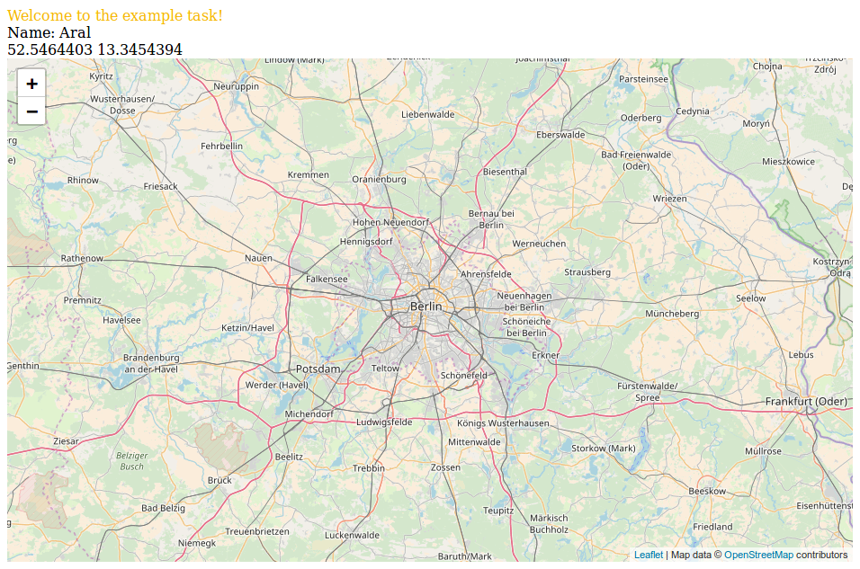

# Overview
The repo is about building a web application for users who want to find a gas
station in Berlin. The final goal is that a user can click on a map and the
application shows the name of the nearest gas station and the location of the
gas station on a map. The web-application has two parts.
 - The client (in the `client` directory). This is a react application showing the map.
 - The server (in the `server` directory). This is a nodejs server which is used to find the
   nearest gas station.

# Getting started
Before you start you should have a recent version of `npm` and `node`
installed.
To start the server go into the `server` directory and run
```
  npm install
  node index.js
```
To see whether the server works check <http://localhost:3000> and see if you get a JSON object
with information about a gas station.

To build the client go into the directory `client` and run
```
npm install
npm run start
```
Then open the file `client/dist/index.hmtl` in the browser. Make sure that the
server is still running! You should see a welcome message, the name of the
first fuel station `Aral` and an empty map of Berlin.

It should look like this: 

# 1 - Display gas station on map
Displays the location of the first gas station on the map. The
map uses the leaflet library.  Uses a marker and position it on the map
(checkout https://leafletjs.com/ for details).

You can find the source code for the client in the directory `client/src`. Once
you make changes re-run `npm start` and refresh the file
`client/dist/index.hmtl` in the browser to see your changes.

# 2 - Get coordinates of map click
When the user clicks on the map captures this event and convert the click into
geocoordinates (lat and lon). When the user clicks, make a request to the
server to get the nearest fuel station. Change the fetch request to the server
to include these coordinates as query string. E.g.
<http://localhost:3000?lat=42.1&lng=12.1>.

# 3 - Get nearest gas station
The server receives the previously sent coordinates.
Instead of returning the first gas station the server returns the nearest
gas station to the sent coordinates.

You can find the source code for the server in `server/index.js`. Once you make
changes re-run the command `npm run start` in the `server` directory.

